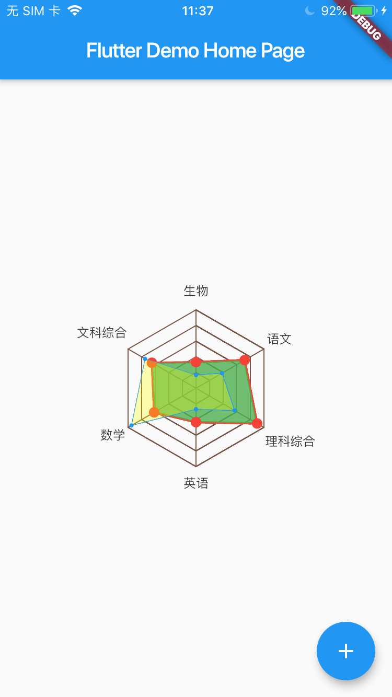

# flutter_radar

A new Flutter package project for radar page.

## 使用
  ```
  Widget buildContent(BuildContext context) {
    return Container(
      child: Radar(dataSource:
        [
          RadarDataSourceConfig([2.0, 4.3, 5.4, 2.6, 3.7,3.9],fill: true,fillColor: Colors.green.withOpacity(0.8)),
          RadarDataSourceConfig([1.0, 2.3, 3.4, 1.6, 5.7, 4.5],
              lineColor: Colors.blue,
              dotColor: Colors.blue,
              dotRadius: 2,
              fill: true,
              showDot: true,
              showLine: true,
              lineWidth: 0.5,
              fillColor: Colors.yellowAccent.withOpacity(0.3))
        ],
        coordinateStyle: CoordinateStyle(1.0,
            yAxisTexts: ["0.0", "1.0", "2.0", "3.0", "4.0", "5.0"],
            xAxisTexts: ["生物","语文","理科综合","英语","数学","文科综合"],
          lineColor: Colors.brown,
          lineWidth: 1,
          gridSpace: 15,
          showYAxisText: false,
          xScaleCount: 6,
          yScaleCount: 6
        ),
        size: Size(MediaQuery.of(context).size.width,
            MediaQuery.of(context).size.width),
      ),
    );
  }
  ```
  RadarDataSourceConfig类生成雷达图里的数据，可生成多个RadarDataSourceConfig。

  ## 效果图
  
